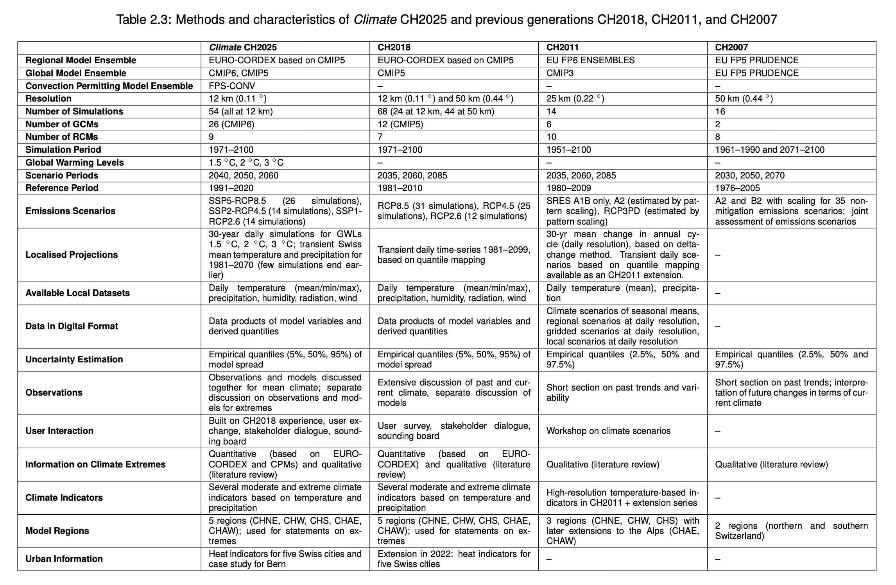

# Swiss Climate Change Scenarios

Since 2007, Climate Scenarios for Switzerland have been developed by MeteoSwiss, ETH Zurich, and C2SM, with contributions from the broader Swiss climate research community, under the umbrella of the National Centre for Climate Services (NCCS).

For more information, please visit [Overview of previous Swiss Climate Change Scenarios :material-open-in-new:](https://www.meteoswiss.admin.ch/climate/climate-change/swiss-climate-scenarios/reports-data-and-graphs-of-climate-change-scenarios/overview-of-previous-swiss-climate-change-scenarios.html)

## CH2025

The Swiss Climate Change Scenarios CH2025 expand on previous findings with longer measurement series and information from new, high-resolution climate models. The qualitative statements remain unchanged from the CH2018 climate scenarios, but the quantitative estimates have changed.

!!! info
    Reports, data, and other materials can be found at the official CH2025 websites:
    - [CH2025 site :material-open-in-new:](https://www.meteoswiss.admin.ch/about-us/research-and-cooperation/projects/2023/climate-ch2025.html){:target="_blank"}.
    - [NCCS site :material-open-in-new:](https://www.nccs.admin.ch/nccs/en/home/climate-change-and-impacts/schweizer-klimaszenarien-ch2025.html)

## CH2018

The Swiss Climate Change Scenarios CH2018 provide an update to the CH2011 climate scenarios with an additional seven years’ worth of data, a basis on a new generation of climate models with increased spatial resolution, and more insights into extreme events and local climate indicators.  

!!! info
    Reports, data, and other materials can be found at the official CH2018 website: [CH2018 :material-open-in-new:](https://www.nccs.admin.ch/nccs/en/home/climate-change-and-impacts/swiss-climate-change-scenarios.html){:target="_blank"}

## CH2011

The Swiss Climate Change Scenarios CH2011 data provides an assessment of how temperature and precipitation may change over the 21st century in Switzerland. The dataset consists of three parts.

- [Download full CH2011 report :material-open-in-new:](https://data.c2sm.ethz.ch/ch2011/CH2011report.pdf){:target="_blank"}
- [Data Download :material-open-in-new:](https://data.c2sm.ethz.ch/ch2011){:target="_blank"}

### Climate scenarios of seasonal means

Climate change scenarios of seasonal mean temperature and precipitation calculated for four seasons, three regions, three scenario periods and three greenhouse gas emission scenarios.

The dataset provides lower, medium and upper estimates of changes in temperature and precipitation relative to the reference period 1980-2009 for three scenario periods (2020-2049, 2045-2074, 2070-2099) and the A1B, A2 and RCP3PD emission scenarios.

### Regional scenarios at daily resolution based on probabilistic method

Daily scenarios derived from the CH2011 climate scenarios of seasonal means. For each region, each scenario period and each emission scenario, the four seasonal mean changes of the individual projection estimates were transformed into a continuous annual cycle.

The dataset provides lower, medium and upper estimates of changes in temperature and precipitation relative to the reference period 1980-2009 for three scenario periods (2020-2049, 2045-2074, 2070-2099) and the A1B, A2 and RCP3PD emission scenarios.

### Local scenarios at daily resolution based on individual model chains

Daily scenarios of temperature and precipitation changes at MeteoSwiss observational station sites for each day of the year, for the three scenario periods and ten individual GCM-RCM model chains. Only the A1B emission scenario is covered.

The dataset provides changes relative to the reference period 1980-2009 for three scenario periods (2021-2050, 2045-2074, 2070-2099) and 10 GCM-RCM model chains at 188 (temperature) and 565 (precipitation) stations in Switzerland.
