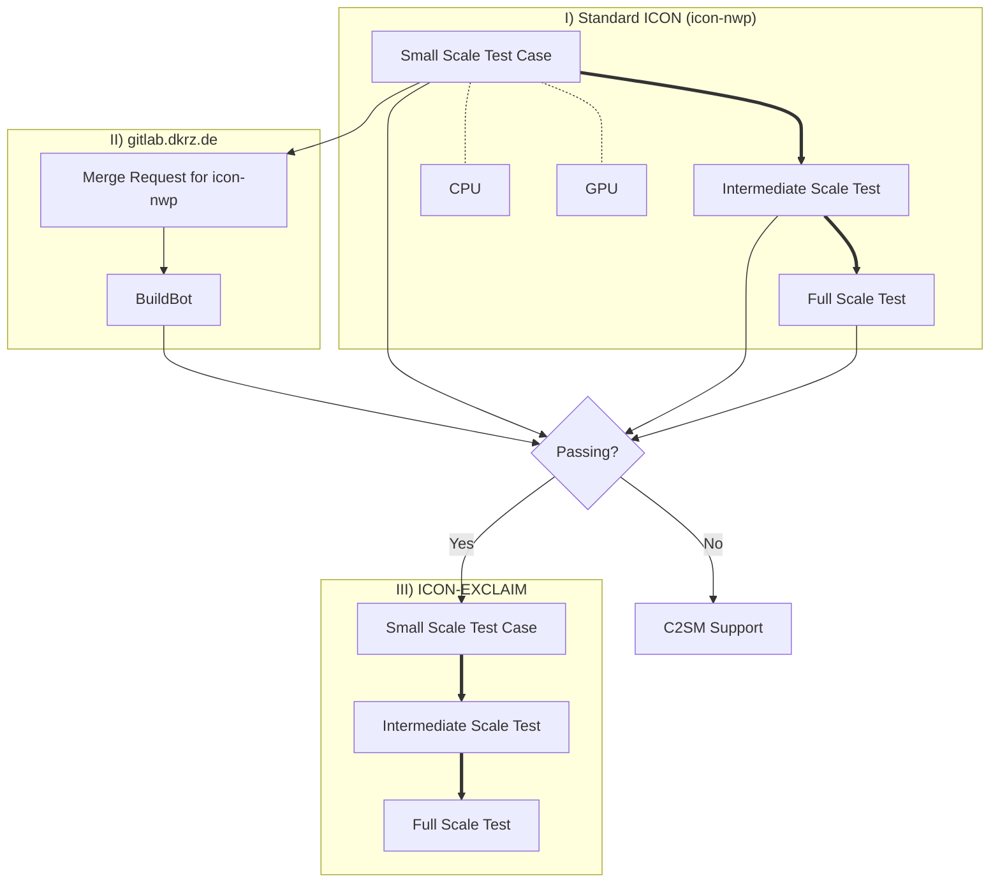

# Large Use Cases

[ICON :material-open-in-new:](https://www.icon-model.org/icon_model){:target="_blank"} is a complex piece of software and even more so is [ICON-EXCLAIM :material-open-in-new:](https://github.com/C2SM/icon-exclaim){:target="_blank"} that builds on top of it. Troubleshooting large scale configurations can therefore be tedious, which is why we developed a procedure to build large production ICON configurations in the most robust way possible.

The overall philosophy is to build a series of gradually increasing complexity setups from a small scale ICON test case to the full production configuration. Even if it could feel like an overhead when starting the whole process, C2SM's core team is there to assist you in this journey and it will pay off in the end!

## Flow Chart

## 1. Small Scale Test Case

The idea here is to test the code path of the final setup and identify potential issues coming from upstream source code.

### 1.1 Set up

Set up an ICON test case by cloning [`icon-nwp` :material-open-in-new:](https://gitlab.dkrz.de/icon/icon-nwp){:target="_blank"}
and integrate in the ICON testing infrastructure with a low number of grid points
and a few time steps (about 6). Existing use cases like the [Aquaplanet :material-open-in-new:](https://gitlab.dkrz.de/icon/icon-nwp/-/blob/master/run/exp.exclaim_ape_R02B04){:target="_blank"} one can serve as a template. Your test case should be saved as `run/exp.<experiment_name>`.

### 1.2 Local testing
1. Add a checksuite file of your experiment under `run/checksuite.icon-dev/exp.<experiment_name>` (use one of the other check files as a template)
2. Add experiment/test settings under `scripts/experiments/<institution>/*.yml`:
    - Have a look at `scripts/experiments/c2sm/mch_experiments.yml`:
        - `type` should contain all file IDs, which are set in each `output_nml` under `output_filename` as unique identifier in your test case

#### Test on CPU
To ensure that there are no basic issues with the namelist, we recommend to start testing on CPU before going over to GPU testing.

#### Test on GPU

### 1.3 Activate Test in a CI Pipeline

## 2. Intermediate Scale Tests
The purpose here is to, still with a *standard* ICON, catch issues that could arise when increasing space and time scales. Because we still would like to be able to debug without waiting hours in the queue, it could be wise to come up with setups using few nodes and testing either/or: 

- approaching the memory limits of the nodes
- long simulations

## 3. Full scale test with *standard* ICON

## 4. Switch to ICON-exclaim

