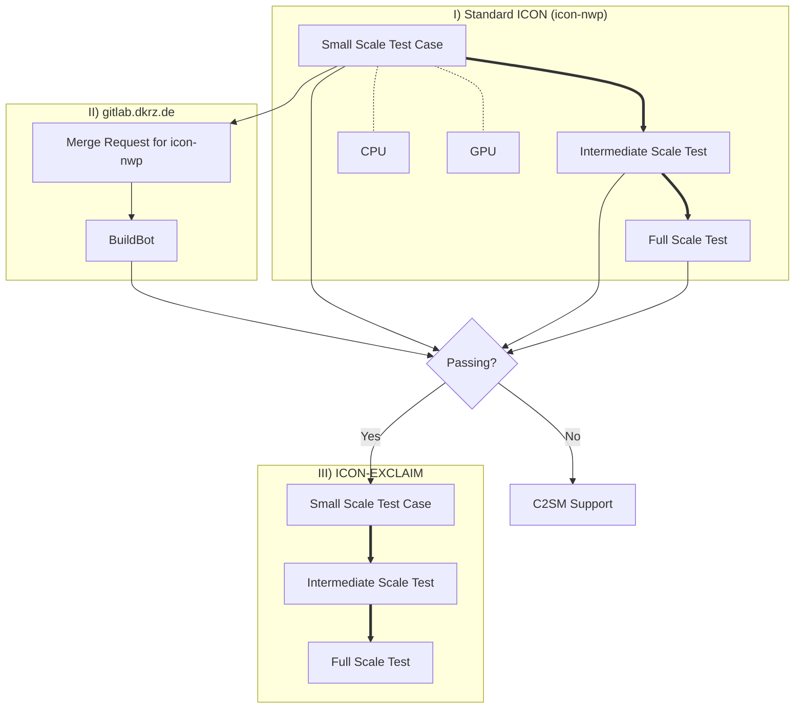

# Large Use Cases

[ICON :material-open-in-new:](https://www.icon-model.org/icon_model){:target="_blank"} is a complex piece of software and even more so is [ICON-EXCLAIM :material-open-in-new:](https://github.com/C2SM/icon-exclaim){:target="_blank"} that builds on top of it. Troubleshooting large scale configurations can therefore be tedious, which is why we developed a procedure to build large production ICON configurations in the most robust way possible.

The overall philosophy is to build a series of gradually increasing complexity setups from a small scale ICON test case to the full production configuration. Even if it could feel like an overhead when starting the whole process, C2SM's core team is there to assist you in this journey and it will pay off in the end!

## Flow Chart



## 1. Small Scale Test Case

The idea here is to test the code path of the final setup and identify potential issues coming from upstream source code.

### 1.1 Set up

Set up an ICON test case by cloning [`icon-nwp` :material-open-in-new:](https://gitlab.dkrz.de/icon/icon-nwp){:target="_blank"}
and integrate in the ICON testing infrastructure with a low number of grid points
and a few time steps (about 6). Existing use cases like the [Aquaplanet :material-open-in-new:](https://gitlab.dkrz.de/icon/icon-nwp/-/blob/master/run/exp.exclaim_ape_R02B04){:target="_blank"} one can serve as a template. Your test case should be saved as `run/exp.<experiment_name>`.

### 1.2 Local testing
Follow the step-by-step guide in [How to add experiments to a buildbot list :material-open-in-new:](https://gitlab.dkrz.de/icon/wiki/-/wikis/How-to-setup-new-test-experiments-for-buildbot#how-to-add-experiments-to-a-buildbot-list){:target="_blank"} to add you experiment test case. Start with the `checksuite_modes` for the mpi and nproma test (`'nm'`) for the machine you are testing on.

We recommend you to do out-of-source builds for CPU and GPU so that you can have two compiled versions of ICON in the same repository.

#### Test on CPU
To ensure that there are no basic issues with the namelist, we recommend to start testing on CPU before going over to GPU testing. First, compile icon-nwp on CPU following the instructions in [Configure and compile :material-open-in-new:](https://c2sm.github.io/models/icon/#configure-and-compile){:target="_blank"} (<span style="color:orange">*TODO*</span>: fix link before merging). Then create the check file and run the test locally (`EXP=<exp_name>`):

```bash
./make_runscripts ${EXP}
./run/make_target_runscript in_script=checksuite.icon-dev/check.${EXP} in_script=exec.iconrun out_script=check.${EXP}.run EXPNAME=${EXP}
cd run
sbatch --partition debug --time 00:30:00 check.${EXP}.run
```

!!! note
    If you are using an out-of-source build, make sure to have copied the `scripts` folder of icon-nwp into it.

Check in the LOG file if all tests passed.

#### Test on GPU
If all tests are validating on CPU, the next step is to test on GPU. First, compile icon-nwp on GPU. Then create the check file and run the mpi and nproma test locally as above. If those tests also validate on GPU, you can continue with the tolerance test to ensure that running on GPU gives basically the same results as running on CPU. Therefore, change the `checksuite_mode` to `'t'` for the tolerance test and follow the instructions in [Validating with probtest without buildbot references (Generating tolerances for non standard tests) :material-open-in-new:](https://gitlab.dkrz.de/icon/wiki/-/wikis/GPU-development/Validating-with-probtest-without-buildbot-references-(Generating-tolerances-for-non-standard-tests){:target="_blank"}).

### 1.3 Activate Test in a CI Pipeline

## 2. Intermediate Scale Tests
The purpose here is to, still with a *standard* ICON, catch issues that could arise when increasing space and time scales. Because we still would like to be able to debug without waiting hours in the queue, it could be wise to come up with setups using few nodes and testing either/or: 

- approaching the memory limits of the nodes
- long simulations

## 3. Full scale test with *standard* ICON

## 4. Switch to ICON-exclaim

