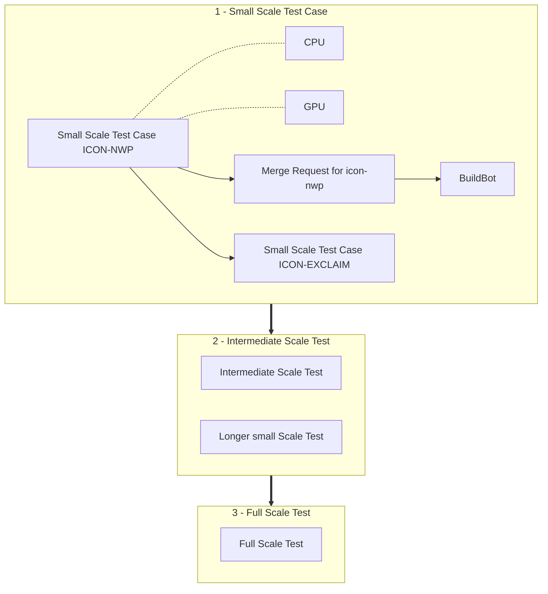

# Large Use Cases

[ICON :material-open-in-new:](https://www.icon-model.org/icon_model){:target="_blank"} is a complex piece of software and even more so is [ICON-EXCLAIM :material-open-in-new:](https://github.com/C2SM/icon-exclaim){:target="_blank"} that builds on top of it. Troubleshooting large scale configurations can therefore be tedious, which is why we developed a procedure to build large production ICON configurations in the most robust way possible.

The overall philosophy is to build a series of gradually increasing complexity setups from a small scale ICON-NWP test case to the full production configuration. Complexity can grow in two independent spaces, namely code (from ICON-NWP to ICON-EXCLAIM) and scales (resolution and duration). We will first tackle the first one and then scale up the simulation setup.

Even if it could feel like an overhead when starting the whole process, C2SM's core team and the EXCLAIM team are there to assist you in this journey and it will pay off in the end!

## Flow Chart



## 1. Small Scale Test Case

The idea here is to test the code path of the final setup and identify potential issues coming from upstream source code.

### 1.1 Set up

#### Clone

First, clone [`icon-nwp` :material-open-in-new:](https://gitlab.dkrz.de/icon/icon-nwp){:target="_blank"} (if you don't have access, you need to request it by DKRZ):

```bash
git clone --recurse-submodules git@gitlab.dkrz.de:icon/icon-nwp.git
```

#### Create Test Case

Then set up an ICON test case with a low number of grid points and a few time steps (about 6) and save it under `run/exp.<my_exp>`. Existing use cases like the [Aquaplanet :material-open-in-new:](https://gitlab.dkrz.de/icon/icon-nwp/-/blob/master/run/exp.exclaim_ape_R02B04){:target="_blank"} one can serve as a template.

#### Add Test Case to Checksuite

Follow the step-by-step guide in [How to add experiments to a buildbot list :material-open-in-new:](https://gitlab.dkrz.de/icon/wiki/-/wikis/How-to-setup-new-test-experiments-for-buildbot#how-to-add-experiments-to-a-buildbot-list){:target="_blank"} to add your test case to the checksuite. Start with the `checksuite_modes` for the mpi and nproma tests (`'nm'`) for the machine you are testing on.

#### Compile Out-of-Source

Follow the instructions in [Configure and compile](compile_and_run.md#building-out-of-source){:target="_blank"} to compile ICON 
out-of-source for CPU and GPU.

### 1.2 Local Testing

Before adding anything to the official ICON, we recommend you to run all tests locally first starting with CPU.

For running the check scripts in the following, you need to have loaded a probtest environment and CDO and export `BB_NAME` to your builder. E.g. for Säntis:
```bash
uenv start icon
export BB_NAME=santis_cpu_nvidia
```

#### Test on CPU

To ensure that there are no basic issues with the namelist, we recommend to start testing on CPU before going over to GPU testing. Create the check file and run the test locally in the folder you built CPU in (set `EXP=<exp_name>`):

```bash
./make_runscripts ${EXP}
./run/make_target_runscript in_script=checksuite.icon-dev/check.${EXP} in_script=exec.iconrun out_script=check.${EXP}.run EXPNAME=${EXP}
cd run
sbatch --partition debug --time 00:30:00 check.${EXP}.run
```

Check in the LOG file if all tests passed.

#### Test on GPU

If all tests are validating on CPU, the next step is to test on GPU. Follow the same steps as for CPU and run nproma and mpi test. Again, check in the LOG file to see if all tests passed before proceeding to the next step.

To ensure that running on GPU gives essentially the same results as running on CPU, please follow the instructions in [Validating with probtest without buildbot references (Generating tolerances for non standard tests) :material-open-in-new:](https://gitlab.dkrz.de/icon/wiki/-/wikis/GPU-development/Validating-with-probtest-without-buildbot-references-(Generating-tolerances-for-non-standard-tests)){:target="_blank"}). If probtest validates, you can change the `checksuite_modes` to `'t'` and everything is set for activating the test in a CI pipeline.

### 1.3 Activate Test in a CI Pipeline

If you followed the steps above in [1.2 Local testing](large_use_cases.md#12-local-testing), everything is set to activate the test in a CI pipeline. Therefore, push your changes to a branch on icon-nwp and open a merge request. Then follow the instructions in [Member selection for generating probtest tolerances :material-open-in-new:](https://gitlab.dkrz.de/icon/wiki/-/wikis/GPU-development/Member-selection-for-generating-probtest-tolerances){:target="_blank"} for adding tolerances and references as well as best members for generating them to the CI pipeline.

### 1.4 Small Test Case with ICON-EXCLAIM

Now it is time to switch to ICON-EXCLAIM, which binds ICON-NWP with modules rewritten in GT4PY, so that we can test the code path in those as well. To that purpose, simply take the small scale test case generated above and replace the ICON executable by the relevant one.

!!! note "ICON-EXCLAIM CI"

    When avaialble, it would also make sense to integrate your setup in the ICON-EXCLAIM testing infrastrucutre.

## 2. Intermediate Scale Test

To test the scalability of ICON simulations under demanding conditions while minimizing queue wait times, we can design tests to stretch computational limits in memory and time. Here are some steps to extend your setup to meet these goals.

### 2.1 Increase Horizontal Resolution with Fixed Node Count

*Goal:* Test memory scaling behavior by increasing resolution without increasing node count.

*Method:* 
Increase the model's horizontal grid resolution (i.e., decrease grid spacing) to improve spatial accuracy. 
        This will require more memory per node due to higher data density but will not increase the node count.
        Monitor the memory usage closely on each node, and consider using profiling tools to track memory allocation patterns and potential memory overflow risks.


*Expected Outcome:* This test will reveal the memory thresholds on individual nodes for your current setup and may highlight areas where memory optimization or node allocation adjustments are necessary.

!!! note "Monitor Memory Usage"

    Approaching the memory limits without exceeding them can help identify how close the current node allocation is to becoming unsustainable at higher resolutions. If necessary, consider using memory-aware scheduling tools to balance memory loads across nodes if available.

### 2.2 Run Longer Simulations (e.g., One Year vs. One Month)

*Goal:* Assess the model's stability and resource consumption over prolonged simulation periods, revealing any potential issues with computational drift or resource leaks.

*Method:* Run the small scale test for an extended period, e.g., one year instead of one month, to test how well the model holds up over time.

*Expected Outcome:* Catching issues like numerical drift, stability loss, or escalating memory/CPU demands that aren’t noticeable in shorter simulations.

## 3. Full Scale Test

At the end of this journey, we're finally ready to launch the full scale runs and start doing science with them! :material-party-popper:
