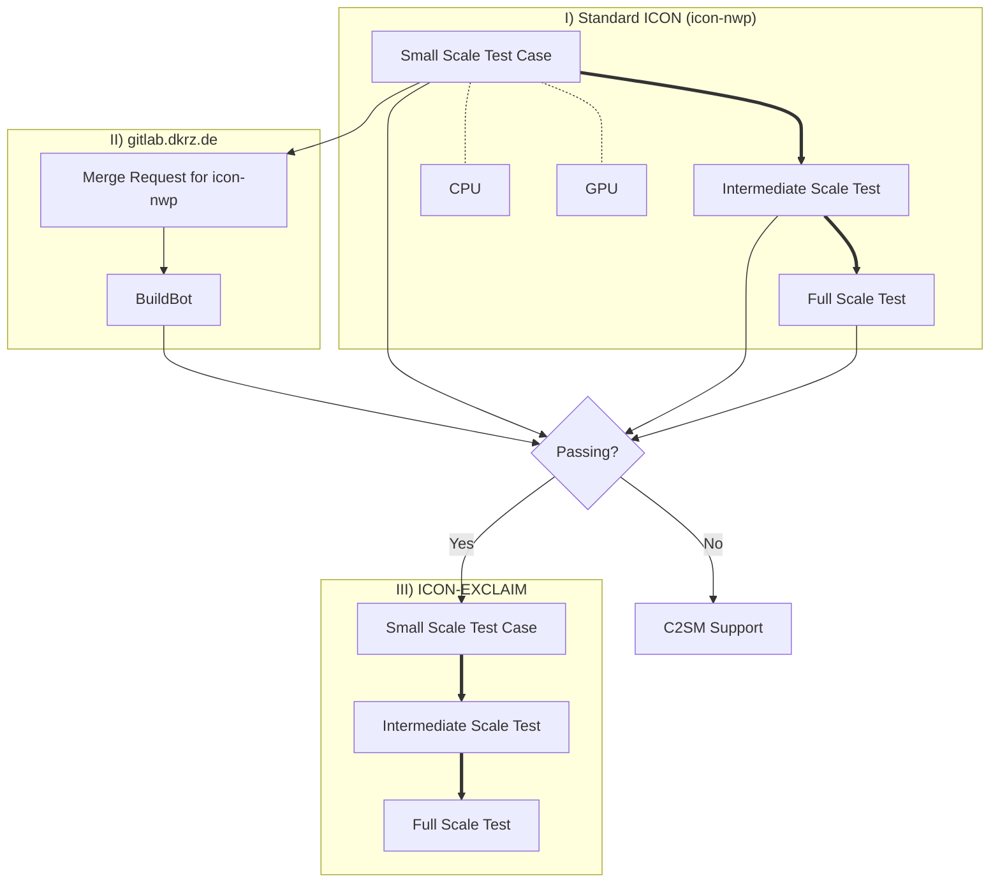

# Large Use Cases

[ICON :material-open-in-new:](https://www.icon-model.org/icon_model){:target="_blank"} is a complex piece of software and even more so is [ICON-EXCLAIM :material-open-in-new:](https://github.com/C2SM/icon-exclaim){:target="_blank"} that builds on top of it. Troubleshooting large scale configurations can therefore be tedious, which is why we developed a procedure to build large production ICON configurations in the most robust way possible.

The overall philosophy is to build a series of gradually increasing complexity setups from a small scale ICON test case to the full production configuration. Even if it could feel like an overhead when starting the whole process, C2SM's core team is there to assist you in this journey and it will pay off in the end!

## Flow Chart



## 1. Small Scale Test Case

The idea here is to test the code path of the final setup and identify potential issues coming from upstream source code.

### 1.1 Set up

First, clone [`icon-nwp` :material-open-in-new:](https://gitlab.dkrz.de/icon/icon-nwp){:target="_blank"} (if you don't have access, you need to request it by DKRZ):

```bash
git clone --recurse-submodules git@gitlab.dkrz.de:icon/icon-nwp.git
```
Then set up an ICON test case with a low number of grid points and a few time steps (about 6) and save it under `run/exp.<my_exp>`. Existing use cases like the [Aquaplanet :material-open-in-new:](https://gitlab.dkrz.de/icon/icon-nwp/-/blob/master/run/exp.exclaim_ape_R02B04){:target="_blank"} one can serve as a template.

Follow the step-by-step guide in [How to add experiments to a buildbot list :material-open-in-new:](https://gitlab.dkrz.de/icon/wiki/-/wikis/How-to-setup-new-test-experiments-for-buildbot#how-to-add-experiments-to-a-buildbot-list){:target="_blank"} to add your test case to the checksuite. Start with the `checksuite_modes` for the mpi and nproma tests (`'nm'`) for the machine you are testing on.

We recommend you to do out-of-source builds for CPU and GPU so that you can have two compiled versions of ICON in the same repository. Therefore, you simply need to create to folders in the the ICON root folder (e.g. `nvhpc_cpu` and `nvhpc_cpu`) and copy the folders `config` and `scripts` from the root folder into it. Then follow the instructions in [Configure and compile :material-open-in-new:](usage.md/#configure-and-compile){:target="_blank"} to compile ICON on CPU and on GPU from within those folders.

### 1.2 Local testing

Before adding anything to the official ICON, we recommend you to run all tests locally first starting with CPU.

#### Test on CPU
To ensure that there are no basic issues with the namelist, we recommend to start testing on CPU before going over to GPU testing. Create the check file and run the test locally in the folder you built CPU in (set `EXP=<exp_name>`):

```bash
./make_runscripts ${EXP}
./run/make_target_runscript in_script=checksuite.icon-dev/check.${EXP} in_script=exec.iconrun out_script=check.${EXP}.run EXPNAME=${EXP}
cd run
sbatch --partition debug --time 00:30:00 check.${EXP}.run
```

Check in the LOG file if all tests passed.

#### Test on GPU
If all tests are validating on CPU, the next step is to test on GPU. Follow the same steps as for CPU and run nproma and mpi test. Again, check in the LOG file if all tests passed before going over to the next step.

To ensure that running on GPU gives basically the same results as running on CPU. Therefore, please follow the instructions in [Validating with probtest without buildbot references (Generating tolerances for non standard tests) :material-open-in-new:](https://gitlab.dkrz.de/icon/wiki/-/wikis/GPU-development/Validating-with-probtest-without-buildbot-references-(Generating-tolerances-for-non-standard-tests)){:target="_blank"}). If probtest validates, you can change the `checksuite_modes` to `'t'` and everything is set for activating the test in a CI pipeline.

### 1.3 Activate Test in a CI Pipeline
If you followed the steps above in [1.2 Local testing](large_use_cases.md#12-local-testing), everything is set to activate the test in a CI pipeline. Therefore, push your changes to a branch on icon-nwp and open a merge request. Then follow the instructions in [Member selection for generating probtest tolerances :material-open-in-new:](https://gitlab.dkrz.de/icon/wiki/-/wikis/GPU-development/Member-selection-for-generating-probtest-tolerances){:target="_blank"} for adding tolerances and references as well as best members for generating them to the CI pipeline.


## 2. Intermediate Scale Tests
The purpose here is to, still with a *standard* ICON, catch issues that could arise when increasing space and time scales. Because we still would like to be able to debug without waiting hours in the queue, it could be wise to come up with setups using few nodes and testing either/or: 

- approaching the memory limits of the nodes
- long simulations

## 3. Full scale test with *standard* ICON

## 4. Switch to ICON-EXCLAIM

