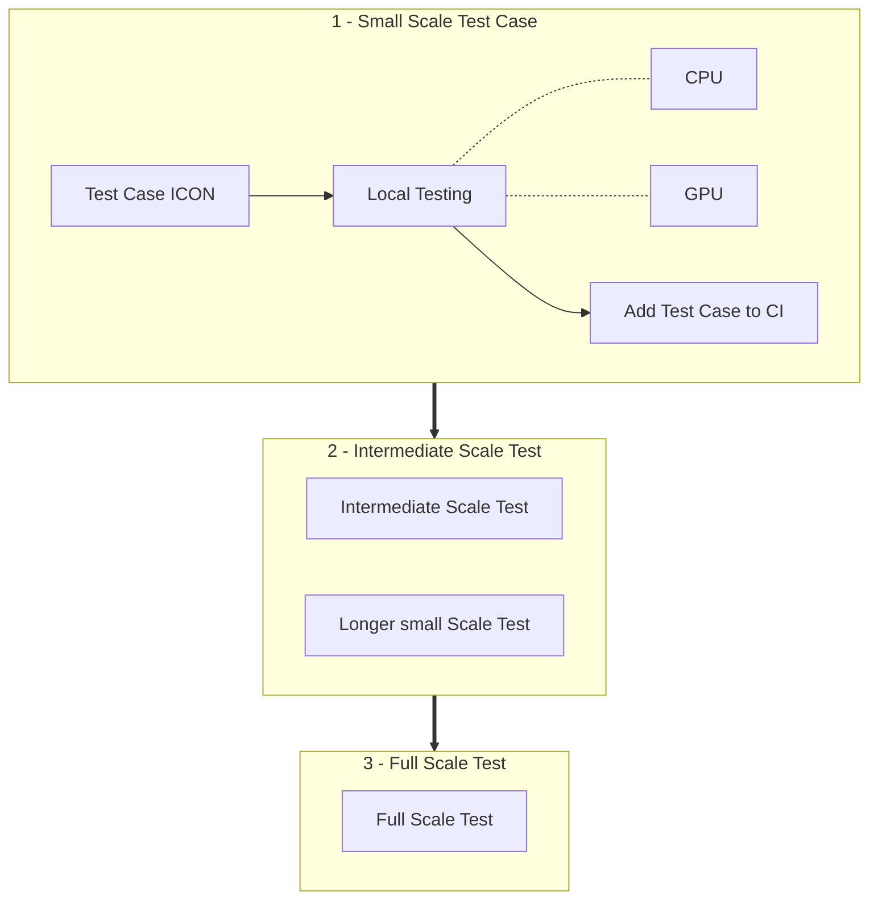

# Validate Custom Namelist

[ICON :material-open-in-new:](https://www.icon-model.org/icon_model){:target="_blank"} is a complex software, and troubleshooting large configurations can be difficult. To avoid problems, we recommend starting every new namelist configuration with a small test case. Add this test case to the ICON CI to ensure it stays compatible with future developments.

You can find a list of available tests in the ICON documentation for the latest ICON-NWP version under [System Tests :material-open-in-new:](https://icon.gitlab-pages.dkrz.de/icon-nwp/infrastructure/testing/system_tests.html#ref-infrastructure-system-tests){:target="_blank"} within `CI System Tests on External Machines by Builder`.

After the initial test case, we suggest building up step by step: from a small ICON test case to increasingly complex setups, and finally to your full production configuration.

If you are working with a downstream version of ICON (e.g., [ICON-EXCLAIM :material-open-in-new:](https://github.com/C2SM/icon-exclaim){:target="_blank"}), make sure everything runs first in upstream ICON (e.g., [ICON-NWP :material-open-in-new:](https://gitlab.dkrz.de/icon/icon-nwp){:target="_blank"}). This helps you identify whether an issue comes from the upstream version or from your downstream modifications.

!!! info "Accesss upstream ICON"

    If you don't have access to upstream ICON, you need to request it by DKRZ.

## Flow Chart



## 1. Small Scale Test Case

The idea here is to test the code path of the final setup but with only a few time steps to have the test case small enough for CI.

### 1.1 Set up

#### Compile Out-of-Source

Follow the instructions in [Configure and compile](compile_and_run.md) to compile ICON out-of-source for CPU and GPU.

#### Create Test Case

Set up an ICON test case with a low number of grid points and a few time steps (about 6) and save it under `run/exp.<my_exp>`. Existing use cases like the [Aquaplanet :material-open-in-new:](https://gitlab.dkrz.de/icon/icon-nwp/-/blob/master/run/exp.exclaim_ape_R02B04){:target="_blank"} one can serve as a template.

#### Add Test Case to Checksuite

Follow the step-by-step guide in [How to add experiments to a CI list :material-open-in-new:](https://gitlab.dkrz.de/icon/wiki/-/wikis/How-to-set-up-new-test-experiments-for-CI#how-to-add-experiments-to-a-ci-list){:target="_blank"} to add your test case to the checksuite. Start with the `checksuite_modes` for the base tests (`'b'`) for the machine you are testing on.

!!! note "Add test cases to out-of-source build"

    Don't forget to add all your changes also to the out-of-source builds.

### 1.2 Local Testing

Before adding anything to the official ICON, we recommend you to run all tests locally starting with CPU.

For running the check scripts in the following, you need to have loaded a probtest environment and CDO and export `BB_NAME` to your builder.

=== "Santis"
    ```console
    export BB_NAME=santis_cpu_nvhpc
    # Point to Python image
    export SQFS_PATH=/capstor/store/cscs/userlab/cws01/ci/ci-python-image/py_icon_ci.squashfs
    ```

=== "Balfrin"
    ```console
    source /scratch/d1000/apps/buildbot/bb-venv/bin/activate
    module load cdo
    export BB_NAME=balfrin_cpu_nvidia
    ```

#### Test on CPU

To ensure that there are no basic issues with the namelist, we recommend to start testing on CPU before going over to GPU testing. 

Set experiment name, e.g.:
```console
export EXP=c2sm_clm_r13b03_seaice
```
Then, create the check run scripts:

```console
./make_runscripts ${EXP}
./run/make_target_runscript in_script=checksuite.icon-dev/check.${EXP} in_script=exec.iconrun out_script=check.${EXP}.run EXPNAME=${EXP}
```

!!! warning "Compute account"
    Ensure that your default account at CSCS has computing resources. If this is not the case, you need to open a ticket 
    at the [CSCS Service Desk :material-open-in-new:](https://jira.cscs.ch/plugins/servlet/desk/site/global){:target="_blank"}.

Now run the check run scripts:

=== "Santis"
    ```console
    export UENV_VERSION=$(cat ../config/cscs/SANTIS_ENV_TAG)
    cd run
    mkdir -p .venv # Create empty folder for mounting Python image
    uenv run ${UENV_VERSION},${SQFS_PATH}:$(pwd)/.venv --view modules,default -- bash -c 'source $(pwd)/.venv/bin/activate && module load nvhpc cdo && ./check.${EXP}.run 2>&1 | tee LOG.check.${EXP}.run.o'
    ```

=== "Balfrin"
    ```console
    cd run && sbatch ---partition debug --time 00:15:00 ./check.${EXP}.run
    ```

Check in the LOG file if all tests passed.

#### Test on GPU

If all tests are validating on CPU, the next step is to test on GPU. Follow the same steps as for CPU and run the *nproma* and *mpi* test. Again, check in the LOG file to see if all tests passed before proceeding to the next step.


##### Run Probtest
To ensure that running on GPU gives essentially the same results as running on CPU, you can make use of [Probtest :material-open-in-new:](https://github.com/MeteoSwiss/probtest?tab=readme-ov-file#probtest){:target="_blank"}. Therefore, make use of the entries you made to the YML files and initialise Probtest starting with 10 ensemble members for the CPU reference. Note that you have to set `pinit_seed = 0` and `pinit_amplitude = 0` in the namelist `initicon_nml` in your test case for running a perturbed ensemble.

=== "Santis"
    Check the instructions in [Run Probtest on Säntis](./probtest.md).

=== "Balfrin"
    ```console
    export BB_NAME=balfrin_cpu_nvidia
    file_id=$("scripts/experiments/get_probtest_file_id" --experiment ${EXP})
    python externals/probtest/probtest.py init --codebase-install $PWD --experiment-name ${EXP} --reference $PWD $file_id --member-ids $(seq -s, 1 10)
    ```

    Then follow the Probtest instructions [Example: Check the output of an ICON experiment with an test build compared to a reference build :material-open-in-new:](https://github.com/MeteoSwiss/probtest?tab=readme-ov-file#example-check-the-output-of-an-icon-experiment-with-an-test-build-compared-to-a-reference-build){:target="_blank"} skipping the *Initialize probtest* step.

 If probtest validates, you can change the `checksuite_modes` to `'t'`, add the tag `probtest` and the CPU builder to `refgen` in the `scripts/experiments/<institution>/*_tests.yml`. Now everything is set for activating the test in a CI pipeline.

### 1.3 Activate Test in a CI Pipeline

If you followed the steps above in [1.2 Local testing](#12-local-testing), everything is set to activate the test in a CI pipeline. Therefore, push your changes to a branch on ICON and open a merge request. Then follow the instructions in [Member selection for generating probtest tolerances :material-open-in-new:](https://gitlab.dkrz.de/icon/wiki/-/wikis/GPU-development/Member-selection-for-generating-probtest-tolerances){:target="_blank"} for adding tolerances and references as well as best members for generating them to the CI pipeline.

## 2. Intermediate Scale Test

To test the scalability of ICON simulations under demanding conditions while minimizing queue wait times, we can design tests to stretch computational limits in memory and time. Here are some steps to extend your setup to meet these goals.

### 2.1 Increase Horizontal Resolution with Fixed Node Count

*Goal:* Test memory scaling behavior by increasing resolution without increasing node count.

*Method:* 
Increase the model's horizontal grid resolution (i.e., decrease grid spacing) to improve spatial accuracy. 
        This will require more memory per node due to higher data density but will not increase the node count.
        Monitor the memory usage closely on each node, and consider using profiling tools to track memory allocation patterns and potential memory overflow risks.


*Expected Outcome:* This test will reveal the memory thresholds on individual nodes for your current setup and may highlight areas where memory optimization or node allocation adjustments are necessary.

!!! note "Monitor Memory Usage"

    Approaching the memory limits without exceeding them can help identify how close the current node allocation is to becoming unsustainable at higher resolutions. If necessary, consider using memory-aware scheduling tools to balance memory loads across nodes if available.

### 2.2 Run Longer Simulations (e.g., One Year vs. One Month)

*Goal:* Assess the model's stability and resource consumption over prolonged simulation periods, revealing any potential issues with computational drift or resource leaks.

*Method:* Run the small scale test for an extended period, e.g., one year instead of one month, to test how well the model holds up over time.

*Expected Outcome:* Catching issues like numerical drift, stability loss, or escalating memory/CPU demands that aren’t noticeable in shorter simulations.

## 3. Full Scale Test

At the end of this journey, we're finally ready to launch the full scale runs and start doing science with them! :material-party-popper:
